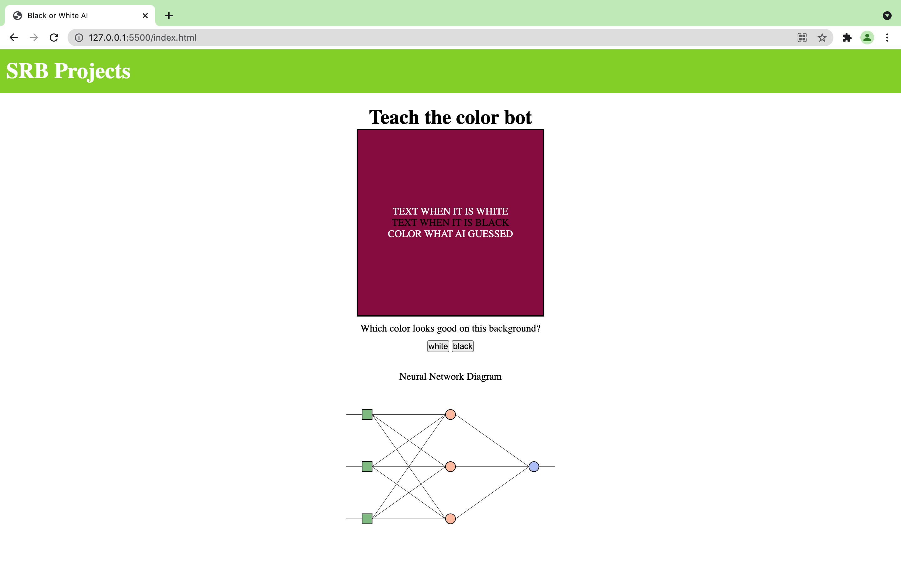

# basic_ColorMatching_MLAI
A color matching ML AI system which uses GPU accelerated Neural networks. It takes in users input to learn efficiently which color text is appropriate for the different background color.

Used package:
Brain.js

Stack Frame:
HTML and CSS for UI
Javascript for logic

